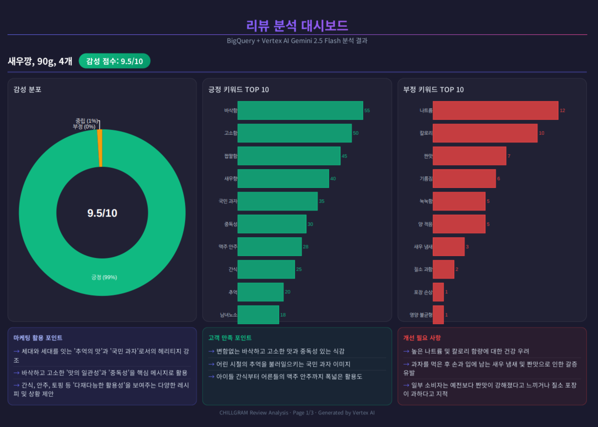
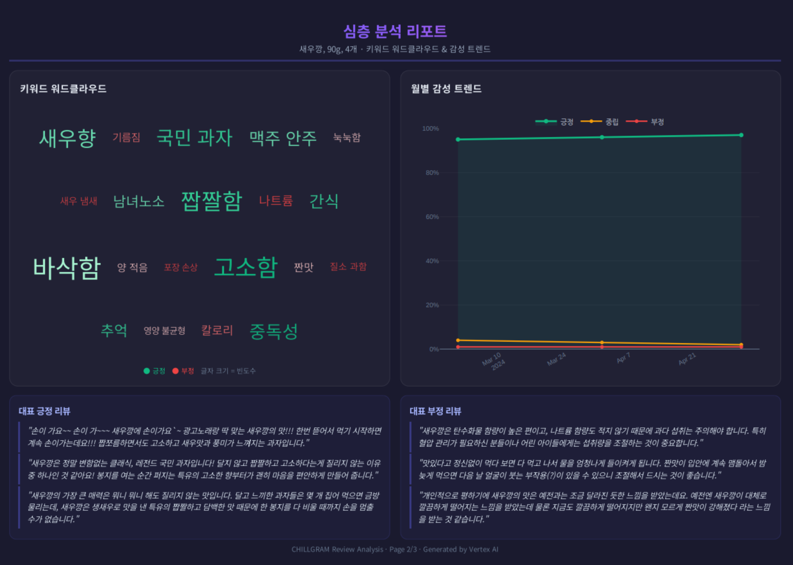
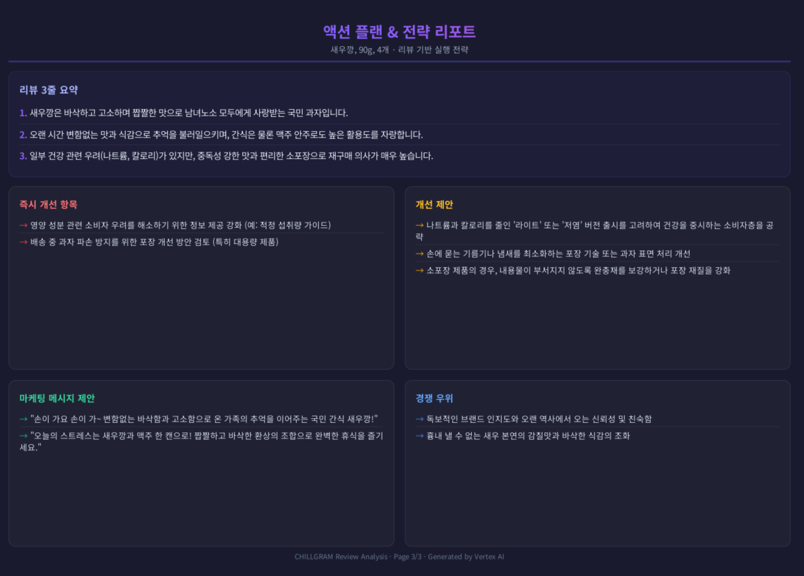
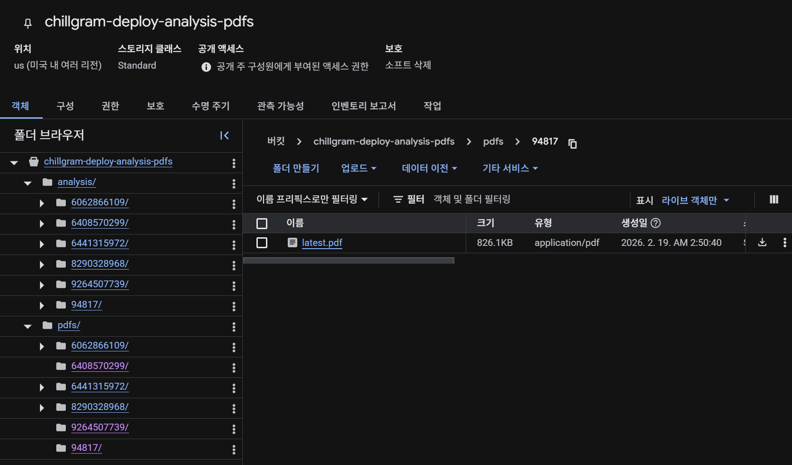

# Chillgram Data Analysis

> 쿠팡 상품 리뷰를 자동 크롤링하고, Vertex AI(Gemini)로 감성 분석 및 인사이트를 추출하여 PDF 대시보드 리포트를 생성하는 End-to-End 파이프라인

---

## 파이프라인 아키텍처

```
쿠팡 URL 등록 → 리뷰 크롤링 → BigQuery 적재 → Vertex AI 분석 → HTML 대시보드 생성 → PDF 변환 → GCS 저장
```

### 기술 스택

| 영역 | 기술 |
|---|---|
| **Backend** | FastAPI + Uvicorn |
| **크롤링** | undetected-chromedriver + Selenium (프록시 지원) |
| **데이터 저장** | Google BigQuery |
| **AI 분석** | Vertex AI Gemini 2.5 Flash |
| **PDF 생성** | Playwright (HTML → PDF 변환) |
| **파일 저장** | Google Cloud Storage (GCS) |
| **캐시** | Redis (인메모리 fallback 지원) |
| **배포** | Docker + Cloud Build |

---

## 분석 결과 미리보기

### 1. 리뷰 분석 대시보드

감성 분포, 긍정/부정 키워드 TOP 10, 마케팅 활용 포인트, 고객 대표 의견을 한눈에 보여주는 메인 대시보드입니다.



### 2. 심층 분석 리포트

워드클라우드, 월별 감성 트렌드, 대표 긍정/부정 리뷰를 포함한 심층 분석 페이지입니다.



### 3. 액션 플랜 & 전략 리포트

리뷰 3줄 요약, 즉시 개선 항목, 개선 제안, 마케팅 메시지, 경쟁 우위 요소를 정리한 전략 리포트입니다.



### 4. GCS 자동 저장

생성된 PDF 리포트는 Google Cloud Storage에 자동으로 업로드되어 관리됩니다.



---

## 분석 항목

- **감성 분석** — 긍정/부정/중립 비율 및 감성 점수 (1-10)
- **키워드 분석** — 긍정/부정 키워드 TOP 10 (빈도수 포함)
- **리뷰 요약** — 3줄 요약 및 대표 긍정/부정 리뷰
- **인사이트** — 고객 만족/불만족 포인트, 개선 제안, 마케팅 활용 포인트
- **액션 아이템** — 즉시 개선 사항, 마케팅 메시지, 경쟁 우위 요소

---

## 프로젝트 구조

```
├── main.py                    # FastAPI 서버 (전체 파이프라인 통합)
├── run_crawler.py             # 로컬 크롤링 스크립트 (DrissionPage 기반)
├── run_crawler_test.py        # 프록시 기반 크롤링 테스트 스크립트
├── vertex_review_analysis.py  # Vertex AI 리뷰 분석 (독립 실행용)
├── visualize_dashboard.py     # 대시보드 HTML 생성
├── db_save.py                 # 로컬 API 호출로 리뷰 JSON 저장
├── Dockerfile                 # Docker 이미지 빌드
├── entrypoint.sh              # Redis + Uvicorn 실행 스크립트
├── cloudbuild.json            # Google Cloud Build 설정
└── requirements.txt           # Python 의존성
```

---

## API 엔드포인트

### `POST /register`
쿠팡 상품 URL을 등록하고 백그라운드로 전체 파이프라인을 실행합니다.

```json
{
  "coupang_url": "https://www.coupang.com/vp/products/9264507739",
  "max_reviews": 100
}
```

### `GET /status/{product_id}`
크롤링/분석 진행 상태를 확인합니다.

**상태 흐름**: `queued → crawling → saving → analyzing → generating_pdf → done`

### `POST /analyze`
분석 완료된 제품의 PDF 리포트를 다운로드합니다.

---

## 실행 방법

```bash
# 의존성 설치
pip install -r requirements.txt
playwright install chromium

# 서버 실행
uvicorn main:app --host 0.0.0.0 --port 8080
```

### Docker

```bash
docker build -t chillgram-analysis .
docker run -p 8080:8080 chillgram-analysis
```

### 환경 요구사항

- Python 3.11+
- Redis (선택 — 없으면 인메모리 캐시 사용)
- Google Cloud 프로젝트 (`chillgram-deploy`)
- GCP 서비스 계정 키 (BigQuery, Vertex AI, GCS 권한)
